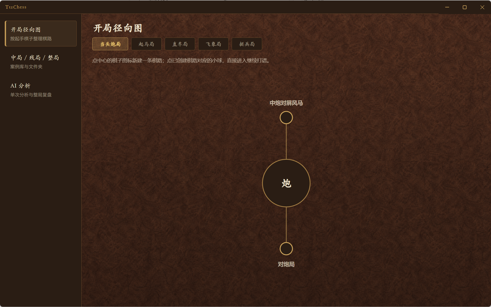
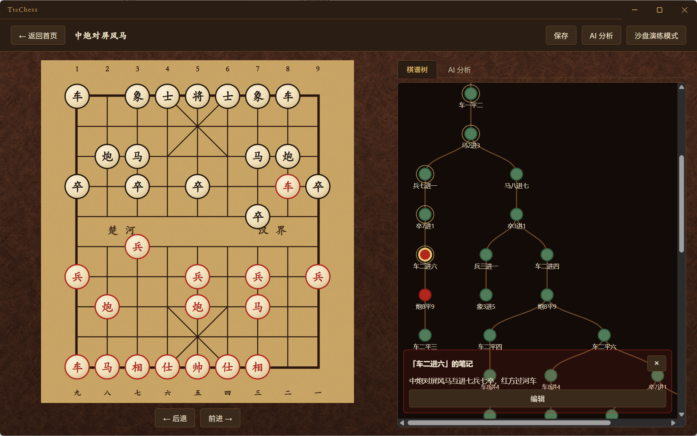
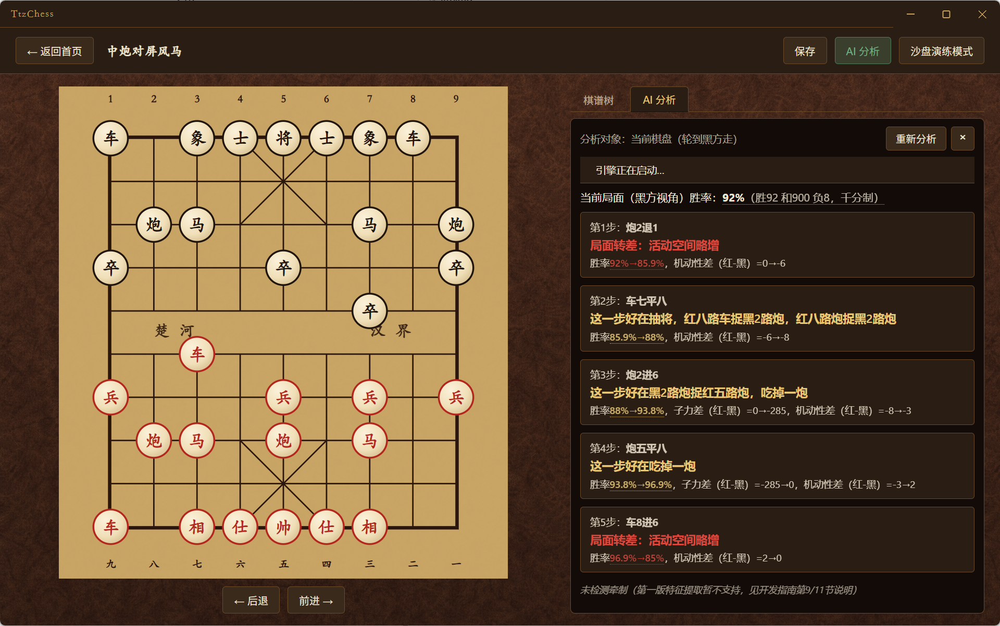
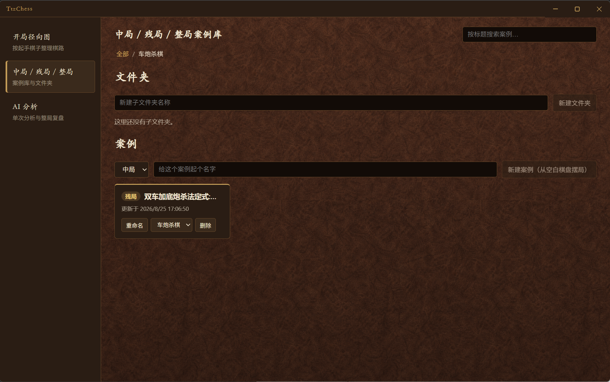
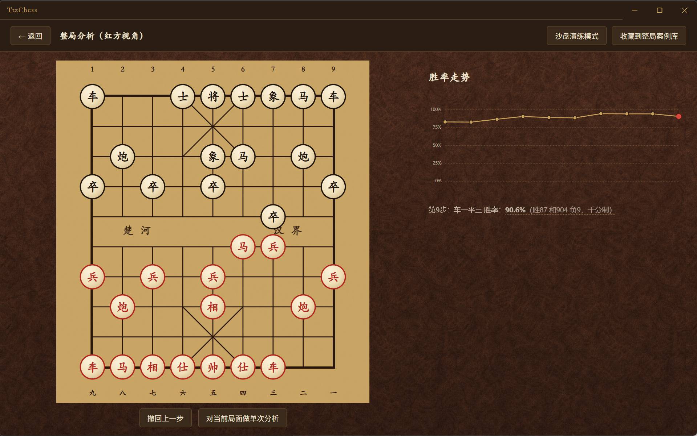

# TtzChess

A local-first Xiangqi (Chinese chess) desktop app for studying openings, saving positions, and running engine analysis. Your games and notes stay on your machine.

[中文](README.md) | **English**

---

Three items on the left sidebar cover everything.

### Opening map

Openings are grouped by the first piece you play: Cannon, Horse, Chariot, Elephant, Pawn. Click a center piece to start a new line. Click a small ball to open an existing one and keep recording.



### Recording a game

The board is on the left, a glowing move tree on the right. Legal moves only. Each move becomes a node; click a node to jump there. Right-click to add a variation or a note. Turn on **Sandbox** to try ideas — turning it off restores the position you started from.



**AI analysis** in the toolbar sends the board as it stands to the engine — no need to set the position up again. It takes over the right-hand column as a second tab next to the move tree, so you can switch back and forth. Works for opening lines and for midgame / endgame / full-game cases alike.



### Midgame / endgame / full games

A case library with folders and search. Midgames and endgames start from an empty board: place pieces, then hit **Start recording**. A full game starts from the standard initial position.

You can hit **Save** halfway through placing pieces and walk away — reopen the case and it is still in setup mode with your pieces where you left them. To change the starting position of a case you already started recording, use **Redo setup** under the board (moves recorded from the old starting position are cleared, with a confirmation first).



### AI analysis

Analysis uses the open-source [Pikafish](https://github.com/official-pikafish/Pikafish) engine.

- **One click, from a study**: analyse the board you are already looking at, no re-setup — see the screenshot under **Study** above.
- **Single position**: set up a board from scratch and see the next few moves, win rate, captures, and threats.
- **Full game**: pick Red or Black, play from the start, and watch a win-rate chart. You can run a single-position analysis on any move, or save the line so far into the full-game library.



---

## Download

No Node.js required. Go to [Releases](https://github.com/promisingZBW/TtzChess/releases) and grab one of:

| File | What it is |
| --- | --- |
| `TtzChess-*-setup.exe` | Installer, Start Menu + desktop shortcut |
| `TtzChess-*-win.zip` | Portable — unzip and run `TtzChess.exe` |

The Pikafish engine is bundled. After install you can click **Start analysis** right away.

See [CHANGELOG.md](CHANGELOG.md) for what changed in each release.

Game data lives in a `data` folder next to the app. To move machines, quit TtzChess and copy that folder over.

### Slow or failing downloads from mainland China

Release assets are not served from `github.com` but from `objects.githubusercontent.com`, which is
frequently unreachable or throttled to a few tens of KB/s inside mainland China — a ~150 MB installer
often dies halfway. The repo source is only ~8 MB, so `git clone` usually works; it is the installer
that breaks. Workarounds: a different network or a VPN, a resumable downloader such as
[aria2](https://aria2.github.io/), or a community GitHub proxy prefix in front of the download URL.

## Run from source

```bash
git clone https://github.com/promisingZBW/TtzChess.git
cd TtzChess
npm install
npm run setup:pikafish
npm run dev
```

Windows build:

```bash
npm run dist:win
```

Output lands in `release/<version>/`.

## License

Source in this repo is for learning and personal use. Analysis launches Pikafish as a separate process (GPL v3) and does not link against its code. See [THIRD_PARTY_LICENSES.md](THIRD_PARTY_LICENSES.md).
